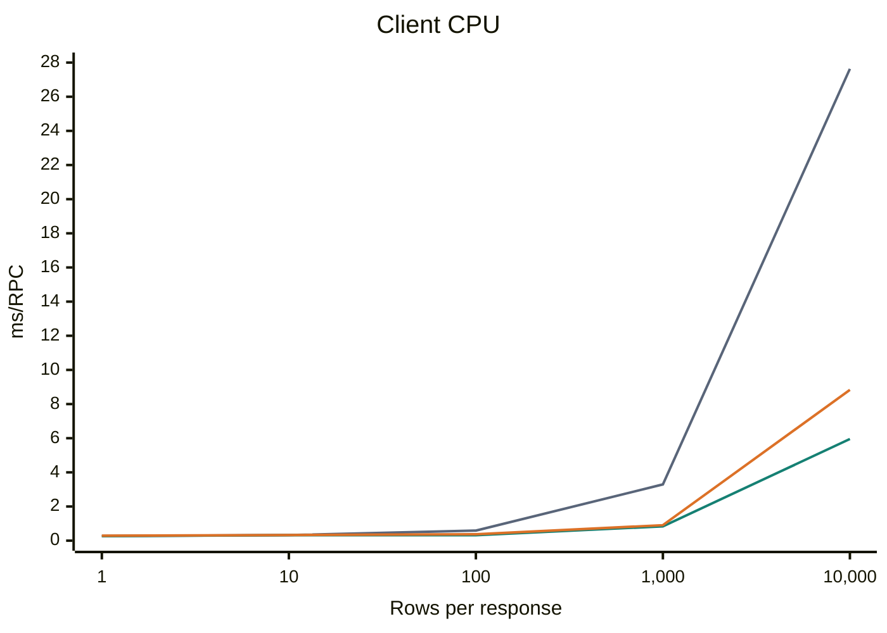
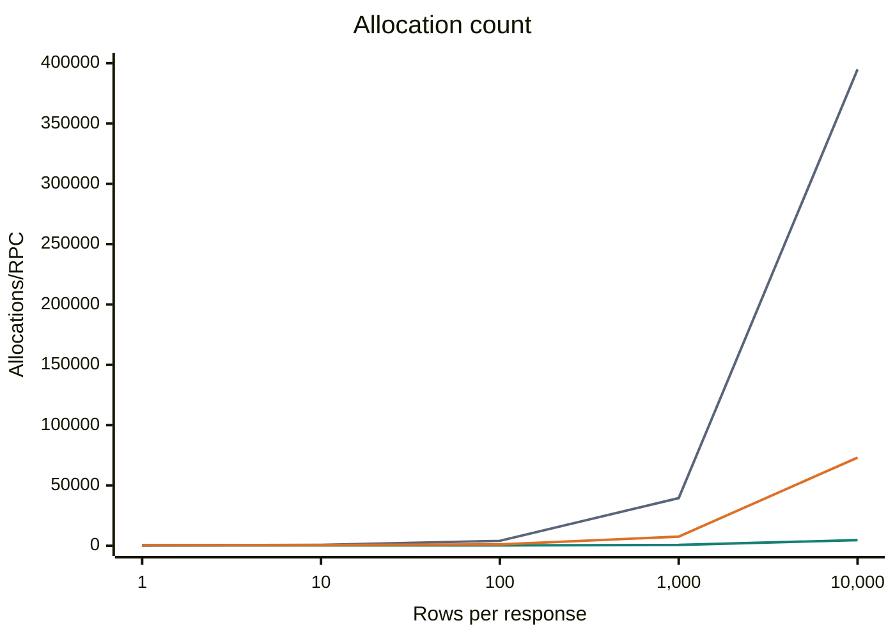

# Query methods and result formats

## Choosing a query method

Choose the method by the expected result shape and how much data the application
can keep in memory. The result format is independent of this choice.

| Method | When to use it | Result handling |
| --- | --- | --- |
| `Exec` | No rows are needed | Executes the query and consumes its results. |
| `QueryRow` | Exactly one row from exactly one result set is expected | Returns an owned row; reports an error for zero rows, additional rows or additional result sets. |
| `Client.QueryResultSet` | Exactly one result set fits in memory | Materializes the result set. Close the returned result set after use. |
| `Session.QueryResultSet` / `TxActor.QueryResultSet` | Exactly one result set is expected, including large results | Reads rows incrementally and checks for additional result sets as the stream is consumed. Close the result set after use. |
| `Client.Query` | All result sets fit in memory | Materializes the entire result. Close the returned result after use. |
| `Session.Query` / `TxActor.Query` | Large results or multiple result sets should be consumed incrementally | Iterate result sets and rows; close the result after use. |

Use `db.Query().Do` to obtain a session with automatic retries, or `DoTx` when
several queries must share a transaction. Consume streaming results inside the
callback and close them before returning. A retry can run the callback again;
account for this when producing application side effects. See the
[streaming query example](README.md#example) and
[transaction example](examples/transaction/query).

## Choosing a result format

| Format and API | Recommended use | Costs and ownership |
| --- | --- | --- |
| `Ydb.Value` through the ordinary query methods | Start here for small results, general type support or applications without an Arrow decoder | Default format; the SDK provides rows and scanners. |
| Arrow through `query.WithResultFormatArrow(ipc.NewReader)` | Evaluate for larger results when retaining `Scan`, `ScanNamed`, `ScanStruct` and `Values` is useful | Rows refer to retained column batches. The decoder scans requested cells directly; `Values` and fallback conversions create owned `types.Value` objects on demand. |
| Raw Arrow through `Session.QueryArrow` | Column processing that can consume Arrow batches directly | Avoids conversion to SDK rows. The application reads IPC, manages Arrow resources, and keeps borrowed column data within the batch lifetime. |

Arrow requires server support and the `EnableArrowResultSetFormat` feature.
`query.WithResultFormatArrow` and the driver default option are experimental. Format selection
does not change materialization: `Client.Query` still keeps the entire result in
memory with Arrow enabled. Session and transaction queries decode one response
part at a time.

The SDK module does not depend on Apache Arrow Go. Pass `ipc.NewReader`
from the Arrow major version selected by your application:

```go
import "github.com/apache/arrow-go/v18/arrow/ipc"

arrowOption := query.WithResultFormatArrow(ipc.NewReader)
// Reader options use the same Arrow Go version:
arrowOption = query.WithResultFormatArrow(ipc.NewReader, ipc.WithAllocator(allocator))
```

Generic reader, record, array and option types are inferred from `ipc.NewReader`;
no explicit type arguments or adapter are required. The same options work
with `github.com/apache/arrow/go/v17/arrow/ipc`. The
[v18 example](examples/apache_arrow) belongs to the examples module and
shows Arrow BulkUpsert, QueryArrow, resource release and scans. Variant columns require Arrow Go v9
or newer; earlier IPC readers cannot read union arrays. Run its [command](examples/apache_arrow/main.go)
with `go run ./apache_arrow` from the `examples` directory after starting a local YDB.

The Arrow decoder supports YDB scalars, including temporal types and all six
time-zone types, Decimal, Pg, Tagged, Null, Void, lists, tuples, structs,
dictionaries, sets, variants and nested Optional values. To add support for a
missing YDB type, open an
[issue](https://github.com/ydb-platform/ydb-go-sdk/issues) or submit a
[pull request](https://github.com/ydb-platform/ydb-go-sdk/pulls).
The Arrow decoder retains each Arrow record once before releasing its IPC reader;
the SDK calls `Release` when the result no longer needs the batch. Decoder
errors follow the ordinary result error path; the SDK does not re-execute SQL
to fall back to another format.

For streaming `Session.Query` / `TxActor.Query` and their `QueryResultSet`
methods, rows are views of the current response part. Consume a row before
advancing to another part, including the read that reaches EOF, skipping a
result set, or closing the result. Moving between rows or batches within the
same part keeps its batches alive. `Scan` output and `Values()` are owned and
remain valid independently; save those when data must outlive the part.
`Client.Query` and `Client.QueryResultSet` retain all batches until the
returned result is closed. `QueryRow` detaches its one row, then reads ahead
to check that there are no further rows or result sets. With Arrow, checking for
another row can decode subsequent parts of the same result set. Their batches
are released when advancing to another part or closing the internal result.

### Type compatibility tests

The [integration tests](tests/integration/arrow/types_integration_test.go)
use table-free `SELECT` expressions. They compare protobuf and `WithResultFormatArrow` for
all supported scalar types, numeric boundaries, special floating-point values,
binary/text data, mixed nullable rows, all-null columns and empty results.
They exercise `Scan`, `ScanNamed`, `ScanStruct` and `Values`, require actual IPC
for non-empty Arrow results and check that Arrow allocations are released.

The same suite compares raw `QueryArrow`, `WithResultFormatArrow` and protobuf for temporal
types, Decimal, UUID, JSON/YSON, DyNumber, Pg values and containers, including
Tagged, EmptyList, EmptyDict and the wide time-zone types TzDate32, TzDatetime64
and TzTimestamp64. It checks nested NULLs, both Variant alternatives, calendar
boundaries and time zones, all three query methods on Client, Session and
TxActor, and multiple response parts/result sets with early Close and prefetch.
Resource results are rejected by YDB as non-persistable with either format.
These tests cover result serialization and decoding; they do not establish which types row or column
tables can store. CI runs the suite against YDB 26.3.1.17.

### Selecting the format per query

The examples below assume `db` is an open driver, `ctx` is a context and
`ipc` is imported from the application's Arrow Go version.

```go
row, err := db.Query().QueryRow(ctx, `SELECT 42 AS id;`,
    query.WithResultFormatArrow(ipc.NewReader),
)
if err != nil {
    return err
}
var id int32
if err := row.Scan(&id); err != nil {
    return err
}
```

The same option applies to `Query`, `QueryRow` and `QueryResultSet` on Client,
Session and TxActor, including calls inside `Do` and `DoTx`. `Exec` also requests
the selected wire format, but discards results without invoking the decoder.

### Selecting the driver default

```go
db, err := ydb.Open(ctx, dsn,
    ydb.WithQueryDefaultResultFormatArrow(ipc.NewReader),
)
if err != nil {
    return err
}
defer db.Close(ctx)

// This query uses Arrow and the ordinary row API.
row, err := db.Query().QueryRow(ctx, `SELECT 42 AS id;`)
if err != nil {
    return err
}
var id int32
if err := row.Scan(&id); err != nil {
    return err
}

// Override the driver default for this query only.
row, err = db.Query().QueryRow(ctx, `SELECT 42 AS id;`, query.WithYdbValue())
if err != nil {
    return err
}
if err := row.Scan(&id); err != nil {
    return err
}
```

`query.WithResultFormatArrow(ipc.NewReader, opts...)` selects a reader factory and its options
for one query; `query.WithYdbValue()` selects the ordinary YDB value format.
Subsequent queries without an override use the driver default again.
`ydb.WithQueryDefaultResultFormatArrow(ipc.NewReader, opts...)` accepts the same
reader factory and options. These defaults do not apply to `ExecuteScript` or
`FetchScriptResults`. Raw `Session.QueryArrow` always requests Arrow IPC.

`database/sql` connectors using Query Service inherit the driver default, including
queries and transactions. The decoder must support the result types of every
query through those connectors. Connectors using Table Service are unaffected.

For raw IPC consumption with `ipc.NewReader(part)`, see the
[example](examples/apache_arrow/README.md#the-same-row-api-with-either-format).

## Local benchmark

The benchmark compares full SELECT execution and consumption of all six columns:

- `Value`: `Session.Query` + `Scan`.
- `QueryArrow`: `Session.QueryArrow` + direct column access.
- `WithResultFormatArrow`: `Session.Query` + `query.WithResultFormatArrow(ipc.NewReader)` from v18 + `Scan`.

All variants use the same session, SQL, row checksum, disabled response prefetch
and a 32 KiB response-part limit. Value and WithResultFormatArrow reuse Scan destinations and
arguments between rows. The WithResultFormatArrow option is created once and reused across
queries. Nullable scans still allocate each non-null destination.
Row handles share one slice per decoded batch, allocated for all rows even when
consumption stops early.
The decoder validates types and selects scan functions once per batch
column. It scans scalar destinations directly, copying strings and bytes
when assigning them. SDK values are created only for `Values` and fallback
conversions.
The table has 10,000 rows: Uint64 id, Optional Int32/Bool/Double/Utf8/String,
10% null in score/name, and a 64-byte payload. Queries return 1, 10, 100, 1,000
or 10,000 ordered rows; the one-row query selects a row with null score/name.
Every RPC checks both row count and checksum.

Environment: Apple M3 Pro, native darwin/arm64 Go 1.27.0, Arrow Go v18.8.0,
GOMAXPROCS=4. The server is `ydbplatform/local-ydb:26.3.1.17`, image digest
`sha256:dec57994cbc96d706aa320443c7d97c8dc6dd580320370d5482f7d61bb22c785`,
linux/amd64 under emulation in an aarch64 Colima VM with 2 vCPU and 15.6 GiB RAM,
in-memory PDisks and anonymous authentication.

Each size was measured in five separate processes, with ten warmup RPCs per
variant. Each process ran 1,000 RPCs per variant for 1/10/100 rows, or 100 RPCs
for 1,000/10,000 rows. Measurements ran without race instrumentation or concurrent
tests/builds. The charts contain medians.

Client CPU is user + system CPU of the client process from `getrusage`, including
decoding, scanning and GC. Elapsed time includes server execution and transport.
Allocated MiB are cumulative Go allocations per RPC, not RSS or peak live memory.
Server CPU and wire payload size were not measured.

### Interpreting the results

For 1/10 rows, WithResultFormatArrow does not show a consistent elapsed-time benefit: its
median changes by -0.2% / -2.9% relative to Value, and the observed ranges overlap.
Client CPU changes by +6.9% / +1.3%. For one row, allocated bytes increase
by 38.1% and allocation count by 28.3%. At 100 rows, WithResultFormatArrow reduces median
client CPU by 36.0% in this workload, while median elapsed time increases by
4.4%; the observed elapsed ranges still overlap.

For 1,000/10,000 rows, WithResultFormatArrow reduces client CPU by 72.4% / 68.0%, elapsed
time by 41.3% / 14.0%, allocated bytes by 80.7% / 72.1% and allocation count
by 80.8% / 81.5% relative to Value. Direct QueryArrow reduces client CPU by
74.5% / 78.5%, but requires a different consumption API and resource ownership.

Use these measurements to select candidates for your own benchmark. They do not
establish universal row-count thresholds: types, row width, nulls, server work,
network and application processing affect the result. Functional Client/TxActor
coverage is separate; the performance measurements above use Session.

### Client CPU



### Allocated memory


### Allocation count



The x-axis lists the measured row counts at equal intervals; the y-axis is
linear. The charts show medians without error bars.

### Reproducing the benchmark

Start a disposable local YDB using the Docker command in the
[test module README](tests/integration/arrow/README.md).
The benchmark creates, loads and drops `/local/query_arrow_benchmark`; it requires
that database and table permissions. Run from the SDK checkout:

```sh
cd tests/integration/arrow
export GOTOOLCHAIN=go1.27.0
for sample in 1 2 3 4 5; do
  go test -tags integration -run '^$' -bench '^BenchmarkFormats$/(1|10|100)$' -benchtime=1000x -count=1 -cpu=4 -v
  go test -tags integration -run '^$' -bench '^BenchmarkFormats$/(1000|10000)$' -benchtime=100x -count=1 -cpu=4 -v
done
```

Set `YDB_CONNECTION_STRING` if it differs from `grpc://localhost:2136/local`.
The test module uses Arrow Go v18.8.0 and requires Go 1.25 or newer.
