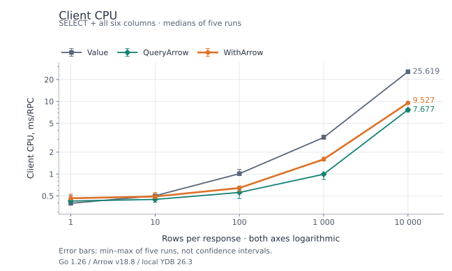
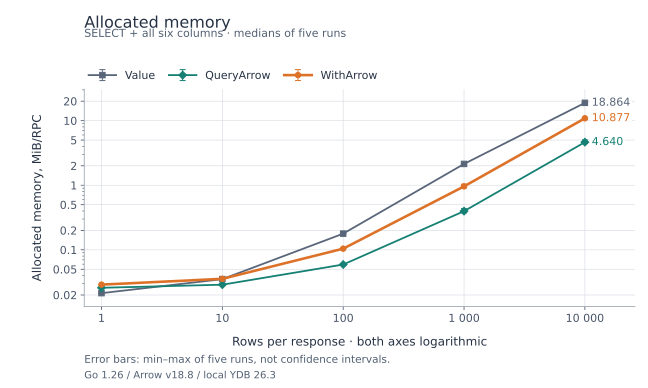
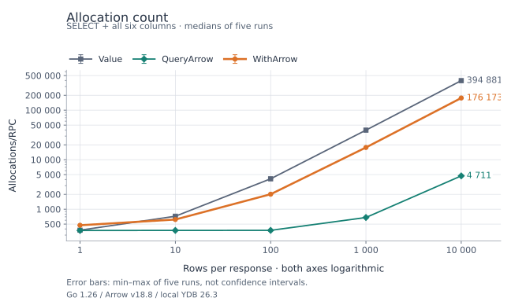

# Query methods and result formats

## Choosing a query method

Choose the method by the expected result shape and how much data the application
can keep in memory. The result format is independent of this choice.

| Method | When to use it | Result handling |
| --- | --- | --- |
| `Exec` | No rows are needed | Executes the query and consumes its results. |
| `QueryRow` | Exactly one row from exactly one result set is expected | Returns an owned row; reports an error for zero rows, additional rows or additional result sets. |
| `Client.QueryResultSet` | Exactly one result set fits in memory | Materializes the result set. Close the returned result set after use. |
| `Session.QueryResultSet` / `TxActor.QueryResultSet` | Exactly one result set is expected, including large results | Reads rows incrementally and checks for additional result sets as the stream is consumed. Close the result set after use. |
| `Client.Query` | All result sets fit in memory | Materializes the entire result. Close the returned result after use. |
| `Session.Query` / `TxActor.Query` | Large results or multiple result sets should be consumed incrementally | Iterate result sets and rows; close the result after use. |

Use `db.Query().Do` to obtain a session with automatic retries, or `DoTx` when
several queries must share a transaction. Consume streaming results inside the
callback and close them before returning. A retry can run the callback again;
account for this when producing application side effects. See the
[streaming query example](README.md#example) and
[transaction example](examples/transaction/query).

## Choosing a result format

| Format and API | Recommended use | Costs and ownership |
| --- | --- | --- |
| `Ydb.Value` through the ordinary query methods | Start here for small results, general type support or applications without an Arrow decoder | Default format; the SDK provides rows and scanners. |
| Arrow through `query.WithArrow(decoder)` | Evaluate for larger results when retaining `Scan`, `ScanNamed`, `ScanStruct` and `Values` is useful | The application decoder converts each response part into owned `types.Value` rows. Conversion processes every column in the part, even if it is not scanned. |
| Raw Arrow through `Session.QueryArrow` | Column processing that can consume Arrow batches directly | Avoids conversion to SDK rows. The application reads IPC, manages Arrow resources, and keeps borrowed column data within the batch lifetime. |

Arrow requires server support and the `EnableArrowResultSetFormat` feature.
`query.WithArrow` and the driver default option are experimental. Format selection
does not change materialization: `Client.Query` still keeps the entire result in
memory with Arrow enabled. Session and transaction queries decode one response
part at a time.

The SDK module does not depend on Apache Arrow Go. Supply a `query.ArrowDecoder`
using the Arrow major version already selected by your application. The
[v18 decoder example](examples/apache_arrow/with_arrow) demonstrates decoding,
resource release, scans and tests. Copy and adapt its
[decoder.go](examples/apache_arrow/with_arrow/decoder.go); the example is a
separate module, not an Arrow dependency of the SDK.

The example supports Bool, signed/unsigned integers, Float, Double, String, Utf8
and one level of Optional. Unsupported types return errors; extend your decoder
for the YDB types used by your queries. A decoder receives column names and YDB
types plus a self-contained IPC part. It must preserve column order and types,
return non-nil owned values, release Arrow resources, and support concurrent
calls. Returned rows must remain valid after subsequent decoding and result
closure. Decoder errors follow the ordinary result error path; the SDK does not
re-execute SQL to fall back to another format.

### Selecting the format per query

The examples below assume `db` is an open driver, `ctx` is a context and
`myArrowDecoder` implements `query.ArrowDecoder`.

```go
row, err := db.Query().QueryRow(ctx, `SELECT 42 AS id;`,
    query.WithArrow(myArrowDecoder),
)
if err != nil {
    return err
}
var id int32
if err := row.Scan(&id); err != nil {
    return err
}
```

The same option applies to `Query`, `QueryRow` and `QueryResultSet` on Client,
Session and TxActor, including calls inside `Do` and `DoTx`.

### Selecting the driver default

```go
db, err := ydb.Open(ctx, dsn,
    ydb.WithQueryDefaultResultFormatArrow(myArrowDecoder),
)
if err != nil {
    return err
}
defer db.Close(ctx)

// This query uses myArrowDecoder and the ordinary row API.
row, err := db.Query().QueryRow(ctx, `SELECT 42 AS id;`)
if err != nil {
    return err
}
var id int32
if err := row.Scan(&id); err != nil {
    return err
}

// Override the driver default for this query only.
row, err = db.Query().QueryRow(ctx, `SELECT 42 AS id;`, query.WithArrow(nil))
if err != nil {
    return err
}
if err := row.Scan(&id); err != nil {
    return err
}
```

`query.WithArrow(otherDecoder)` selects another decoder for one query.
Subsequent queries without an override use the driver default again. Passing
`nil` to `WithQueryDefaultResultFormatArrow` selects the ordinary YDB value
format as the driver default. These defaults do not apply to `ExecuteScript` or
`FetchScriptResults`. Raw `Session.QueryArrow` always requests Arrow IPC.

For raw IPC consumption with `ipc.NewReader(part)`, see the
[example](examples/apache_arrow/with_arrow/README.md#the-same-row-api-with-either-format).

## Local benchmark

The benchmark compares full SELECT execution and consumption of all six columns:

- `Value`: `Session.Query` + `Scan`.
- `QueryArrow`: `Session.QueryArrow` + direct column access.
- `WithArrow`: `Session.Query` + `query.WithArrow` with the example v18 decoder + `Scan`.

All variants use the same session, SQL, row checksum, disabled response prefetch
and a 32 KiB response-part limit. Value and WithArrow reuse Scan destinations and
arguments between rows. Nullable scans still allocate each non-null destination.
The table has 10,000 rows: Uint64 id, Optional Int32/Bool/Double/Utf8/String,
10% null in score/name, and a 64-byte payload. Queries return 1, 10, 100, 1,000
or 10,000 ordered rows; the one-row query selects a row with null score/name.
Every RPC checks both row count and checksum.

Environment: Apple M3 Pro, native darwin/arm64 Go 1.26.0, Arrow Go v18.8.0,
GOMAXPROCS=4. The server is `ydbplatform/local-ydb:26.3.1.17`, image digest
`sha256:dec57994cbc96d706aa320443c7d97c8dc6dd580320370d5482f7d61bb22c785`,
linux/amd64 under emulation in an aarch64 Colima VM with 2 vCPU and 15.6 GiB RAM,
in-memory PDisks and anonymous authentication.

Each size was measured in five separate processes, with ten warmup RPCs per
variant. Each process ran 1,000 RPCs per variant for 1/10/100 rows, or 100 RPCs
for 1,000/10,000 rows. Measurements ran without race instrumentation or concurrent
tests/builds. The table contains medians; elapsed ranges and graph error bars
are the observed min–max across the five runs, not confidence intervals.
[CSV measurements](assets/query-results-benchmark.csv) contain all five runs.

| Rows | API | Elapsed ms/RPC (range) | Client CPU ms/RPC | Allocated MiB/RPC | Allocations/RPC |
| ---: | --- | ---: | ---: | ---: | ---: |
| 1 | `Value` | 1.571 (1.319–1.783) | 0.373 | 0.021 | 377 |
| 1 | `QueryArrow` | 1.478 (1.296–1.576) | 0.403 | 0.026 | 372 |
| 1 | `WithArrow` | 1.434 (1.331–1.560) | 0.384 | 0.029 | 459 |
| 10 | `Value` | 1.378 (1.261–1.795) | 0.434 | 0.035 | 721 |
| 10 | `QueryArrow` | 1.609 (1.342–2.017) | 0.357 | 0.029 | 373 |
| 10 | `WithArrow` | 1.433 (1.339–2.188) | 0.453 | 0.036 | 614 |
| 100 | `Value` | 2.353 (2.212–2.431) | 0.949 | 0.178 | 4,112 |
| 100 | `QueryArrow` | 1.850 (1.495–1.990) | 0.422 | 0.059 | 374 |
| 100 | `WithArrow` | 1.998 (1.818–2.713) | 0.643 | 0.104 | 2,109 |
| 1,000 | `Value` | 6.436 (6.290–6.776) | 3.124 | 2.138 | 39,525 |
| 1,000 | `QueryArrow` | 4.331 (4.029–4.769) | 0.969 | 0.397 | 681 |
| 1,000 | `WithArrow` | 5.581 (5.152–5.861) | 2.342 | 0.961 | 18,799 |
| 10,000 | `Value` | 29.761 (29.330–34.124) | 25.313 | 18.864 | 394,887 |
| 10,000 | `QueryArrow` | 20.793 (19.985–21.414) | 7.095 | 4.640 | 4,717 |
| 10,000 | `WithArrow` | 22.367 (21.834–23.025) | 12.888 | 10.877 | 187,651 |

Client CPU is user + system CPU of the client process from `getrusage`, including
decoding, scanning and GC. Elapsed time includes server execution and transport.
Allocated MiB are cumulative Go allocations per RPC, not RSS or peak live memory.
Server CPU and wire payload size were not measured.

### Interpreting the results

Small responses do not show a consistent elapsed-time benefit from WithArrow:
for 1/10/100 rows its median changes by −8.7% / +4.0% / −15.1% relative to Value,
and the observed elapsed ranges overlap at all three sizes. Client CPU changes
by +2.7% / +4.4% / −32.3%. For one row, allocated bytes increase by 35.5% and
allocation count by 21.8%.

For 1,000/10,000 rows, WithArrow reduces client CPU by 25.0% / 49.1%, elapsed
time by 13.3% / 24.8%, allocated bytes by 55.1% / 42.3% and allocation count by
52.4% / 52.5% relative to Value. Direct QueryArrow reduces client CPU by
69.0% / 72.0%, but requires a different consumption API and resource ownership.

Use these measurements to select candidates for your own benchmark. They do not
establish universal row-count thresholds: types, row width, nulls, server work,
network and application processing affect the result. Functional Client/TxActor
coverage is separate; the performance measurements above use Session.

### Client CPU



### Allocated memory



### Allocation count



Both axes are logarithmic.

### Reproducing the benchmark

Start a disposable local YDB using the Docker command in the
[example README](examples/apache_arrow/with_arrow/README.md#checks-and-local-benchmark).
The benchmark creates, loads and drops `/local/query_arrow_benchmark`; it requires
that database and table permissions. Run from the SDK checkout:

```sh
cd examples/apache_arrow/with_arrow
for sample in 1 2 3 4 5; do
  go test -tags integration -run '^$' -bench '^BenchmarkFormats$/(1|10|100)$' -benchtime=1000x -count=1 -cpu=4 -v
  go test -tags integration -run '^$' -bench '^BenchmarkFormats$/(1000|10000)$' -benchtime=100x -count=1 -cpu=4 -v
done
```

Set `YDB_CONNECTION_STRING` if it differs from `grpc://localhost:2136/local`.
The example uses Arrow Go v18.8.0 and requires Go 1.25 or newer.
