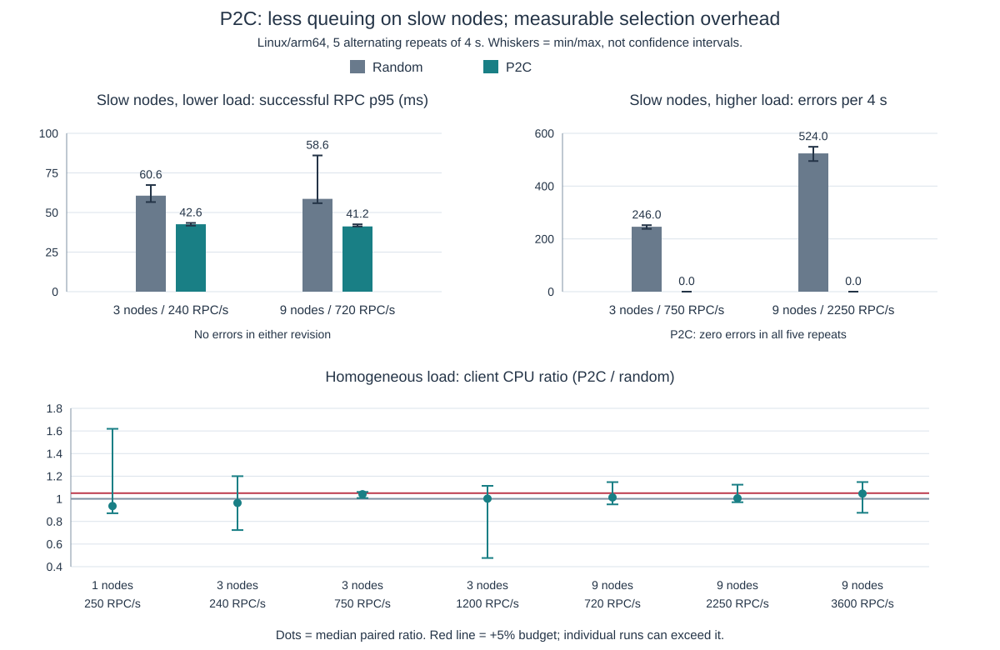

# P2C experiment

Compare random choice and power-of-two-choices on the same open-loop workload,
using the SDK's balancer, connection wrappers and real gRPC transports. The mock
nodes run in a separate subprocess; client CPU excludes server CPU.

```sh
python3 tests/benchmarks/p2c/run.py \
  --base 70bac0b118eb66d95704490e9ed03bc17769c308 \
  --repeats 5 --duration 4s --gomaxprocs 2 --output /tmp/ydb-p2c-results
```

The runner builds the unchanged baseline with the same harness, then alternates
baseline/candidate order between repetitions. `metadata.json` records revisions,
patch and executable hashes, toolchain and parameters. `runs.jsonl` retains every
run, including failures, percentiles, CPU and per-node inflight observations.

Run on Linux/arm64 with two available CPUs to reproduce the committed series.
The recorded binaries were cross-compiled with Go 1.26.0 and ran natively in an
Ubuntu 24.04 Colima container limited to two CPUs, without host filesystem mounts.

## Model

Each mock node has four processing slots and an 8 ms service time. Slow nodes
take 40 ms; this is a server-capacity model, not an HTTP/2 stream limit or a
measurement of YDB capacity. No SDK retry loop is used. Existing transport-error
pessimization remains enabled in both revisions, including after timeouts.

The matrix covers one homogeneous node and three/nine nodes with:

- Equal service times at 80, 250 and 400 offered RPC/s per node.
- One/two slow nodes at 80 and 250 RPC/s per node.
- Node 1 slowed during the middle third, then restored.
- Two idle long-lived streams on node 1 alongside unary RPCs.
- A slow-node cluster with 90% of requests pinned round-robin by NodeID.

Arrivals follow a fixed schedule, without waiting for previous RPCs. Each RPC
has a deadline one second after its scheduled arrival. Latency includes dispatch
delay, so a stalled generator cannot silently hide waiting time. Throughput
counts successful completions within the offered-load window; error counts
include all submitted calls. CPU includes draining outstanding calls.

Percentiles describe successful calls and must be read together with errors.
The separate RPC and dispatch p95 values help identify generator interference.
Inflight is sampled every 5 ms; stream lifetimes are included. The three phase
p95 values group calls by scheduled arrival, not completion time.

## Microbenchmarks

The two benchmark functions also compile on the baseline: copy the current
`internal/balancer/elector_test.go` and `internal/conn/conn_test.go` into a clean
baseline checkout, then run this command separately in each checkout:

```sh
GOMAXPROCS=4 go test -run '^$' \
  -bench 'BenchmarkEndpointElector|BenchmarkConnInvoke' \
  -benchmem -benchtime=200ms -count=5 ./internal/balancer ./internal/conn
```

`BenchmarkConnInvoke` exercises the connection wrapper against an immediate
mock transport, not a network RPC. The elector benchmark measures the existing
locked RNG under serial and parallel selection, with equal/skewed loads and
1, 2, 9 and 1000 candidates.

## Interpretation

P2C can move new unpinned RPCs away from a connection accumulating unfinished
work. It cannot move already-started or pinned RPCs, change the eligible
priority bucket or increase aggregate server capacity. Its scalar counter treats
an idle stream and an expensive request equally and sees only this shared
client pool, not other clients' load.

The acceptance budget is at most 5% degradation in homogeneous throughput, p95
and client CPU, accounting for variation between repetitions; no additional
unary/selection allocations; and repeatable benefit under skewed load. The mock
experiment is evidence for these conditions, not a production guarantee.

## Recorded results

[Raw runs](results/linux-runs.jsonl) and [metadata](results/linux-metadata.json)
retain all 170 runs: 17 scenarios, two revisions and five repetitions.
The baseline predates the test-only change `97674288f`; the production files
measured here are identical to those in the PR. Source hashes are in metadata.



Regressions below are medians of the five **paired P2C/baseline ratios**, not
ratios of two independently computed medians. Negative CPU/p95 changes are
improvements. Positive throughput changes are improvements. Min/max whiskers
show the observed spread, not confidence intervals; individual runs can exceed
the 5% budget. These measurements do not establish an upper bound on overhead.

| Equal nodes | Offered RPC/s | Client CPU change | p95 change | Throughput change |
|---:|---:|---:|---:|---:|
| 1 | 250 | -6.39% | +0.42% | 0.00% |
| 3 | 240 | -3.63% | +0.11% | 0.00% |
| 3 | 750 | +4.04% | -4.52% | +0.03% |
| 3 | 1200 | +0.15% | -45.70% | +0.10% |
| 9 | 720 | +1.21% | +0.94% | 0.00% |
| 9 | 2250 | +0.44% | -16.22% | +0.02% |
| 9 | 3600 | +4.59% | -53.04% | +0.15% |

Skewed scenarios use one slow node out of three or two out of nine. p95 values
are medians of successful-call percentiles. Error ranges retain all repetitions.

| Scenario | Nodes / RPC/s | Random p95, ms | P2C p95, ms | Random errors / 4 s | P2C errors / 4 s |
|---|---|---:|---:|---:|---:|
| Slow nodes | 3 / 240 | 60.63 | 42.59 | 0 | 0 |
| Slow nodes | 9 / 720 | 58.61 | 41.20 | 0 | 0 |
| Slow nodes | 3 / 750 | 186.44 | 45.40 | 238–252 | 0 |
| Slow nodes | 9 / 2250 | 18.38 | 41.62 | 495–549 | 0 |
| Temporary slowdown | 3 / 750 | 607.93 | 11.45 | 133–188 | 0 |
| Temporary slowdown | 9 / 2250 | 15.14 | 10.60 | 140–196 | 0 |
| Two idle streams | 3 / 750 | 10.82 | 10.15 | 0 | 0 |
| Two idle streams | 9 / 2250 | 13.90 | 10.67 | 0 | 0 |
| 90% pinned | 3 / 180 | 41.98 | 42.09 | 0 | 0 |
| 90% pinned | 9 / 540 | 42.25 | 42.64 | 0 | 0 |

At 9 nodes / 2250 RPC/s with two slow nodes, random's successful-call p95 is lower, but it
loses 495–549 calls; its timeout-triggered pessimization changes subsequent
selection. P2C completes all calls, with a median paired throughput improvement
of 6.15%. The comparable improvement at 3 nodes / 750 RPC/s is 8.84%.

The pinned scenarios show the boundary: latency barely changes. The short
3-node pinned control has a median paired CPU increase of 13.81% (9-node:
3.66%). That increase does not reproduce in the longer control below; these
results do not promise a CPU improvement for pinned workloads.

[Longer controls](results/linux-control-runs.jsonl) use the same binaries and
environment, three alternating repetitions of 20 s. They check whether the
short-run CPU medians persist, retaining all 24 additional runs.

| Control | Nodes / RPC/s | Median CPU change | CPU ratio min–max | Median p95 change | Median throughput change |
|---|---|---:|---|---:|---:|
| Equal | 1 / 250 | -7.70% | 0.905–0.960 | -0.70% | 0.00% |
| Equal | 3 / 750 | +2.46% | 0.942–1.116 | -7.64% | 0.00% |
| Equal | 9 / 3600 | +3.15% | 1.010–1.076 | -50.35% | +0.03% |
| 90% pinned | 3 / 180 | -5.26% | 0.864–1.053 | -0.08% | 0.00% |

Reproduce these controls on the same Linux environment:

```sh
python3 tests/benchmarks/p2c/run.py \
  --base 70bac0b118eb66d95704490e9ed03bc17769c308 \
  --repeats 3 --duration 20s --gomaxprocs 2 --control-only \
  --output /tmp/ydb-p2c-control
```

The [baseline](results/micro-random.txt) and [P2C](results/micro-p2c.txt)
microbenchmarks were run on macOS/arm64, Apple M3 Pro, Go 1.26.0, GOMAXPROCS=4.
Selection has 0 B/op and 0 allocs/op; the unary wrapper has the same 1204 B/op
and 20 allocs/op in both revisions. For nine equal candidates, median serial
selection grows from 7.61 to 19.15 ns; parallel selection grows from 109.7 to
232.6 ns/op. This isolates the cost of two draws from the locked RNG, not the
duration of a network RPC.

For client-side CPU diagnosis, the harness accepts `-cpuprofile /tmp/client.pprof`;
the separately running mock server is not included in that profile.

Regenerate the figure with `python3 tests/benchmarks/p2c/plot.py` (standard library
only). Keep the raw records alongside the figure so readers can check every
scenario, including those not illustrated.
